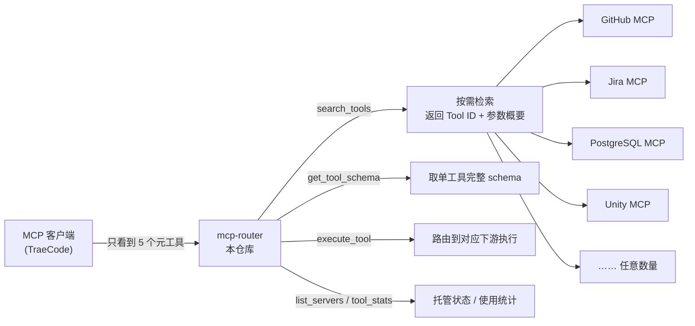

# MCP Router

> TraeCode 只看到 5 个元工具，Router 背后可以管理数百上千个下游 MCP 工具——并保持检索亚毫秒级。

一个把自己伪装成单个 MCP Server、背后聚合任意多个下游 MCP Server 的能力路由器。它解决的是 TRAE 官方的硬限制：

> 所有 MCP Server 工具总数 ≤ 40，描述总字符 ≤ 8000。超出后按工具粒度直接丢弃。

解法**不是**"把 40 改成 400"，而是 `全部工具 → 智能检索 → 动态暴露 → 只给 Agent 当前需要的工具`。

```text
✅ Build  0 errors
✅ Smoke  11/11
✅ E2E    7/7   (Windows 真实进程链路)
✅ Bench  1000 tools → ~0.6ms avg search
```

GitHub: https://github.com/hccccc01333/mcp-router

---

## 架构



客户端永远只拿 5 个元工具，Router 内部通过关键词检索定位真正需要的那个下游工具再执行。这就是 **Tool RAG**——不是把所有 schema 塞给模型。

---

## 为什么做

TRAE 官方明确：MCP 工具会占上下文，太多工具还会分散模型注意力。社区里反复出现：

- 单个 MCP 就有几十个工具（例如一个 Godot MCP 65 个工具）
- 配两三个 MCP 就撞上 40 上限
- 工具太多后模型难以选择

官方当前的兜底是"拆成多个小 Server 并按需启用"——Router 把这句话自动化，**顺着官方架构做事，而不是对抗它**。

---

## 怎么做

完整实现见 `src/`。几个关键模块：

- `search.ts` — 关键词评分检索，对中英文查询友好，加权匹配工具名 / Server 名 / 描述
- `downstream.ts` — 统一的 stdio / HTTP 下游代理：独立超时、失败自动重建连接、**Windows 兼容层**
- `registry.ts` — `server::tool` 命名空间隔离的全局工具目录
- `stats.ts` — 检索命中 / schema 查看 / 调用数 / 错误数统计，为自动工具选择打基础

Agent 典型调用链：`search_tools` → `get_tool_schema` → `execute_tool`。

---

## 验证

真正跑的是 **真实进程链路**（Router → `cmd /c npx` → 下游子进程 → 往返），而不是单测桩：

```text
$ npm run e2e                       # E2E_WAIT_ALL=1
PASS initialize handshake returns mcp-router
PASS tools/list over real stdio exposes exactly the meta-tools
PASS router warms up npx-spawned downstream on win32
PASS search finds add_numbers through spawned chain
PASS execute round-trips to child process
PASS list_servers reports connected spawned server
PASS third-party downstream aggregated into shared catalog
7 passed, 0 failed

[router] everything-4: loaded 13 tool(s)
[router] everything-1: loaded 13 tool(s)
[router] everything-2: loaded 13 tool(s)
[router] everything-3: loaded 13 tool(s)
[router] catalog ready: 54 tool(s) from 5 server(s)
```

这里还顺带验证了：**5 个真实下游聚合出 54 个工具，TraeCode 仍只见 5 个元工具**——突破了 40 上限。

`npm run smoke`（内存协议链路） 11/11 通过。

---

## Benchmark

> `scripts/bench.ts`，InMemory 真实 MCP 协议，每格 `avg / p95`，50 次运行。

| Downstream tools | TraeCode exposed | query="github" | query="postgres fetch" | query 无匹配 |
|---|---|---|---|---|
| 100 | 5 | 0.27 / 0.55 ms | 0.27 / 0.37 ms | 0.21 / 0.27 ms |
| 500 | 5 | 0.41 / 0.59 ms | 0.39 / 0.45 ms | 0.38 / 0.66 ms |
| 1000 | 5 | 0.64 / 0.86 ms | 0.65 / 0.97 ms | 0.52 / 0.63 ms |

**结论：1000 个工具时检索平均约 0.6ms、p95 不足 1ms**。工具规模翻 10 倍，延迟只从 0.27ms 涨到 0.64ms——检索成本随目录增长近乎可忽略。

---

## 一个真实的 Windows 坑

这是纯实测踩出来的。SDK 内部的 cross-spawn 解析裸命令名时在 Windows 上会失败（`'cmd.exe' is not recognized`）。解法：

```ts
// 用 ComSpec 绝对路径包装，而不是依赖 PATH 解析
return { command: comSpec(), args: ["/c", command, ...args] };
```

平台级脏细节正是通用方案和玩具的区别——任何想做同类工具的人都要重踩一遍。

---

## 快速开始

```bash
npm install
npm run build
```

把 `examples/mcp-router.config.example.json` 复制为本地配置（建议 `.gitignore`），把 `mcpServers` 换成你要聚合的所有下游 MCP。

在 TraeCode 中把它添加为一个 MCP Server：

```json
{
  "mcpServers": {
    "mcp-router": {
      "command": "node",
      "args": [
        "/absolute/path/to/mcp-router/dist/index.js",
        "--config",
        "/absolute/path/to/mcp-router.config.json"
      ]
    }
  }
}
```

## 配置

```jsonc
{
  "timeouts": { "connectMs": 30000, "callMs": 90000 },
  "maxResultChars": 24000,
  "mcpServers": {
    "github": { "command": "npx", "args": ["-y", "@modelcontextprotocol/server-github"] },
    "remote": { "url": "https://your-host/mcp", "headers": { "Authorization": "Bearer ${TOKEN}" } }
  }
}
```

- **HTTP / stdio 双下游**：`url` 走 Streamable HTTP，`command` 走 stdio
- **环境变量展开**：`${ENV_NAME}` 从环境读取，密钥不落盘
- **独立超时 + 失败重建**、**结果截断**（应对官方"大型响应会被裁剪"的第二层限制）

## 元工具

| 工具 | 作用 |
|---|---|
| `search_tools` | 检索全部下游工具目录，返回工具卡片（ID + 参数概要） |
| `get_tool_schema` | 取单工具完整入参 schema |
| `execute_tool` | 按 ID 路由到对应下游执行 |
| `list_servers` | 查看所有托管下游 Server 及连接状态 |
| `tool_stats` | 使用统计：检索命中 / schema 查看 / 调用数 / 错误 / 最近检索 |

## 局限性（当前版本未解决）

- **语义检索**：仍是关键词评分，未做 embedding；描述相似的工具可能召回不准
- **权限 / secrets 隔离**：下游之间无权限边界
- **超大 Registry 性能**：仅在内存中线性检索，暂无索引 / 分片
- **Tool chaining planner**：没有多工具编排，单次只执行一个工具

---

## License

MIT